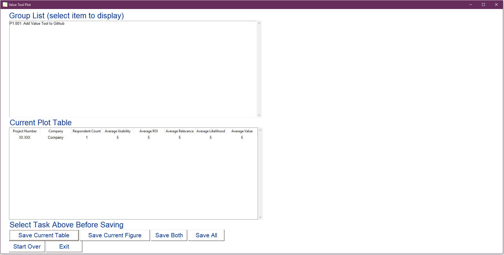
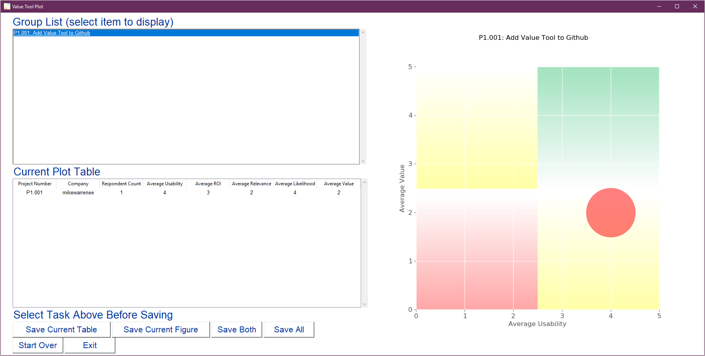

Value Tool
==========

The value tool is a bubble chart plotter using PySimpleGUI and pandas.

It takes as input a list of tasks (with program, project and task for my original purposes for the software) and a list of
respondents who rank the tasks on four metrics.

For my original purposes the metrics are:

  * Usability
  * Return on Investment
  * Relevance
  * Likelihood
  
each on a 1-5 integer scale.

Quickstart
----------

1. Run value_tool.py
2. A splash screen will appear.

3. The prompt, "Load Task List' will appear prompting you to "First select a .xlsx file with program, project and task information in the following schema:
   
   * prog_num - Program Number
   * prog_name - Program Name
   * proj_num - Project Number
   * task - Task Name

4. Select 'OK'.
5. An 'Open' file dialog will appear.
6. Select 'test_task_list.xlsx' or a file with the same schema.
7. Next, the prompt, "Load Respondent List' will appear prompting you to
"Now select a .xlsx file with attendee information in the following schema:

    * company - Company Name
    * email - Respondent Email
    * prog_num - Program Number
    * prog_name - Program Name
    * proj_num- Project Number
    * proj_name - Project Name
    * task - Task Name
    * usability - Task's Usability Score (1-5)
    * roi - Task's Return on Investment Score (1-5)
    * relevance - Task's Relevance Score (1-5)
    * likelihood - Task's Likelihood Score (1-5)
    

8. An 'Open' fiale dialog will appear.
9. Select 'test_respondent_list.xlsx' or a file with the same schema.
10. Next, the 'Value Tool Plot' window will appear.

11. The "Group List" box displays a selectable list of all tasks with an attendee response match.
12. To display a plot select a task from the list.

13. A bubble chart plot will appear on the right side of the window.
14. A table will also appear in the "Current Plot Table" window.
15. The current plot table shows the average scores and computed average value for each utility with a response.

    * For example, if mikewarrenee has two responses for the P1.001 task "Add Value Tool to Github", the average ROI and Relevance will be used to calculate a value.
16. Both plot and table are savebable by using the buttons:

    * Save Current Table
    * Save Current Figure
    * Save Both
    * Save All

17. The plots currently save as *.png while the tables save as *.xlsx.
18. Along with scoring information, the table includes the RGB color values of the bubble corresponding to each utility's scores per task.
19. To load new datasets use the 'Start Over' button. This will restart the program at the splash screen.
20. To exit the program use the 'Exit' button.

Installation
------------

Schema
------
Two files are included with the repo.
These files are:

    * test_task_list.xlsx
    * test_respondent_list.xlsx

test_task_list
~~~~~~~~~~~~~~

test_task_list contains a table with an example task.

Field List - test_task_list.xlsx
^^^^^^^^^^^^^^^^^^^^^^^^^^^^^^^^^

========= ============== ========================= ========
Field     Description    Example                   Required
========= ============== ========================= ========
prog_num  Program Number P1                        Yes
prog_name Program Name   Data Tools                Yes
proj_num  Project Number P1.001                    Yes
proj_name Project Name   Value Tool                Yes
task      Task Name      Add Value Tool to Github  Yes
========= ============== ========================= ========

test_respondent_list
~~~~~~~~~~~~~~~~~~~~
test_respondent_list.xlsx contains a table of a test response for the test task.

Field List - test_respondent_list.xlsx
^^^^^^^^^^^^^^^^^^^^^^^^^^^^^^^^^

========== ===================================== ======================== ========
Field      Description                           Example                  Required
========== ===================================== ======================== ========
company    Company Name                          mikewarrenee             Yes
email      Respondent Email Address              mwarre25@gmail.com         Yes
prog_num   Program Number                        P1                       Yes
prog_name  Program Name                          Data Tools               Yes
proj_num   Project Number                        P1.001                   Yes
proj_name  Project Name                          Value Tool               Yes
task       Task Name                             Add Value Tool to Github Yes
usability  Task Usability Score (1-5)            3                        Yes
roi        Task Return on Investment Score (1-5) 4                        Yes
relevance  Task Relevance Score (1-5)            2                        Yes
likelihood Task Likelihood Score (1-5)           5                        Yes
========== ===================================== ======================== ========

Note: The Value score is computed within the software according to the following 
lookup table: 

